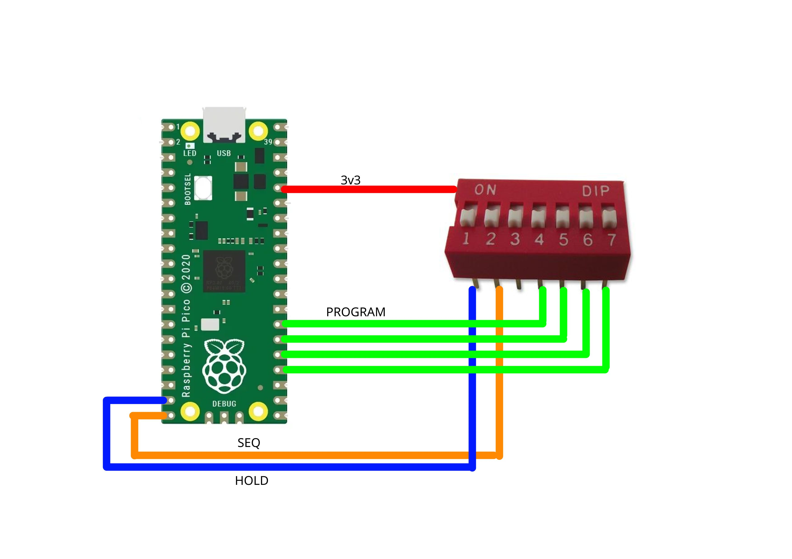

<h1 align="center">PicoDuck</h1>

    A cheap Rubber Ducky using a Raspberry Pi Pico with bonus features.

 

## Features

 - Multiple program support: allows multiple programs to be stored
 - Sequential program support: runs all programs sequencially 1->16
 - Disable pin support: when the configured pinned is powered, the program(s) will refuse to run until released.

## Requirements

 - [Arduino IDE 1.x](https://www.arduino.cc/en/software)
 - [TinyUSB Mouse and Keyboard library](https://github.com/cyborg5/TinyUSB_Mouse_and_Keyboard)
 - [Raspberry Pi Pico Arduino core](https://github.com/earlephilhower/arduino-pico)
 - [Python 3.x](https://www.python.org/downloads)

## Wiring diagram

## Installing

 - Run `generateProgram.py`, this will allow you to easily create a program for your PicoDuck. You can run it with the `-f` option to add a program from a file or use the `-p` to specify a program number/slot.
 - Paste Ducky Script code
 - Press ENTER, type `EOF` and press ENTER again
 - Choose a slot for the program to live in. Available options are 1->16 or quit to cancel.
 - Open the Arduino IDE
 - Go to Tools->Flash Size and set it to `2MB (no FS)`
 - (Optional) Go to Tools->CPU Speed and set it to `125 MHz`
 - (Optional) Go to Tools->Optimize and set it to `Optimize More (-O2)` or `Optimize Even More (-O3)`
 - Go to Tools->USB Stack and set it to `Adafruit TinyUSB`
 - Hold the `BOOTSEL` button on the Raspberry Pi Pico and plug the device into the computer via USB. After `RPI-RP2` appears in the file manager, you can release the button.
 - Click on the veryfy button inside the Arduino IDE. This will compile the code into the output folder. The output folder is usually in:
   - Linux: `/tmp/arduino_build_xxxxxx`
   - Windows: `%TMP%\arduino_build_xxxxxx`
 - Copy the `picoduck.ino.uf2` inside `RPI-RP2` and after it copies, unplug the RPI to stop the code from running.
 - Enjoy :^)

## Usage

You can switch between programs using binary (Sw. 4,5,6,7). For example, to load the first program, use `0001`, to load the third one use `0011`, 0 meaning false and 1 meaning true.

Use the SEQ switch (Sw. 2) to put the PicoDuck into _sequence mode_ which runs all programs stored sequencially.

Use the HOLD switch (Sw. 1) to prevent the PicoDuck to run the program(s) immediately after being plugged into the computer.

## DuckyScript+ extensions:

 - Both `-` and `_` are accepted. For example: `ctrl_alt` or `ctrl-alt`
 - `MOUSE_LEFT (CLICK|HOLD|RELEASE)` - Click/hold/release the left mouse button
 - `MOUSE_MIDDLE|MOUSE_MID (CLICK|HOLD|RELEASE)` - Click/hold/release the middle mouse button
 - `MOUSE_RIGHT (CLICK|HOLD|RELEASE)` - Click/hold/release the right mouse button
 - `MOUSE_MOVE [x] [y]` - Move the mouse to x, y (relative coordinates)
 - `MOUSE_WHEEL [n]` - Move the mouse wheel n times. N needs to be a value of 0 to 128 and can be both positive and negative

